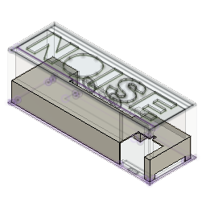
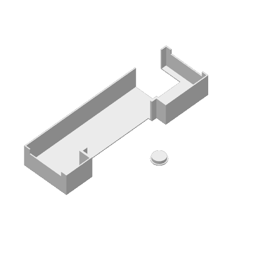
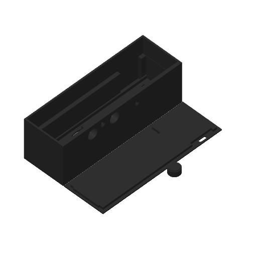
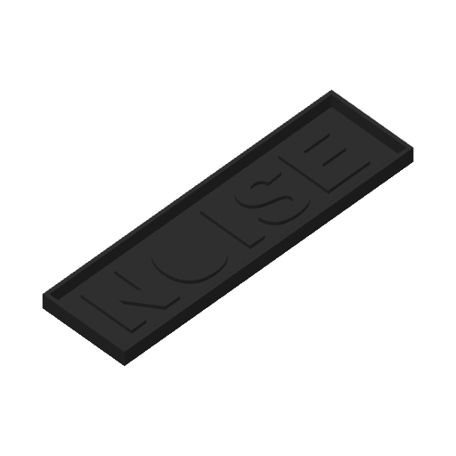
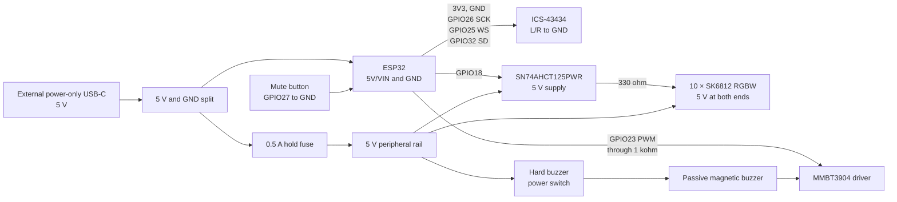

# ESPNoise

ESPNoise is a privacy-first noise warning sign for shared workspaces. An ESP32
measures sound energy and lights the word **NOISE** only when the room stays
loud. Short sounds, such as a cough or a dropped object, do not start the
alarm by themselves.

<p align="center">
  
</p>

The repository includes the production enclosure, hardware design, PlatformIO
firmware, and an optional iPhone settings app.

## Main features

- Sustained-noise detection with a rolling decision window
- Green, orange, and red warning levels
- Ten SK6812 RGB plus warm-white pixels behind a printed diffuser
- Optional passive buzzer with a hard power switch
- A 30-minute mute button
- No raw microphone recording or storage
- Wi-Fi off; Bluetooth Low Energy is used only for the optional app
- Firmware targets for a full-size ESP32 and a LOLIN32 Lite

## Production build

The production build uses a full-size ESP32 board and a separate, power-only
USB-C input. A regulated 5 V supply powers the controller and peripherals. The
ESP32 USB-C port stays inside the enclosure as a firmware-service port. No
battery is necessary.

| Item | Production specification |
| --- | --- |
| Controller | Full-size ESP32 development board with USB-C |
| Microphone | ICS-43434 digital I2S microphone on the carrier PCB |
| Display | 10 SK6812 RGB plus warm-white, 32-bit pixels |
| Data buffer | SN74AHCT125PWR, 3.3 V input to 5 V output |
| Sound | 5 V passive electromagnetic buzzer and MMBT3904 driver |
| Controls | Momentary mute button and maintained hard buzzer switch |
| Power | Regulated 5 V, 2 A minimum; 3 A recommended |
| Enclosure | 164 mm × 54 mm × 54.5 mm main case envelope |

See the [bill of materials](docs/bom.md) for the complete part specification.

## 3D-print files

The ready-to-print package and editable source are in
[`cad/production`](cad/production). Start with one of these files:

- [`espnoise.3mf`](cad/production/espnoise.3mf) contains four arranged plates
  and the saved Bambu Studio print profile.
- [`espnoise.f3d`](cad/production/espnoise.f3d) is the editable Autodesk Fusion
  design.
- The individual STL files support other slicers and printers.

The package contains the case, back, reflector, illuminated letters, optional
letter mould, mute-button cap, and buzzer-switch cap.

| Reflector and switch cap | Case, back, and button cap | Letters | Letter mould |
| :---: | :---: | :---: | :---: |
|  |  |  |  |

The saved profile uses a 0.4 mm nozzle, 0.2 mm layers, two wall loops, 15%
infill, and no supports. Check the profile for your printer and material before
you print. See the [enclosure guide](cad/README.md) for file dimensions,
materials, and assembly notes.

## Wiring

The production wiring uses one common ground. The LED supply does not pass
through the ESP32 board.



| Function | ESP32 pin |
| --- | ---: |
| ICS-43434 clock | GPIO26 |
| ICS-43434 word select | GPIO25 |
| ICS-43434 data | GPIO32 |
| SK6812 data through SN74AHCT125PWR | GPIO18 |
| Buzzer PWM through 1 kohm and MMBT3904 | GPIO23 |
| Mute button to GND | GPIO27 |
| Optional battery-boost enable | GPIO13 |

Keep the buzzer switch in the buzzer 5 V wire. Software must not override this
switch. Keep the external two-wire USB-C input separate from the ESP32
firmware-service port. If the power input exposes CC1 and CC2, connect one
5.1 kohm pull-down from each CC pin to GND. Do not connect CC1 to CC2.

See the [complete wiring guide](docs/wiring.md) and the
[interactive prototype-board diagram](docs/prototype-board-wiring.html) before
assembly.

## How detection works

The default rule listens for one second in each ten-second period. It stores
only the maximum sound level from each observation. At least three of the last
six observations must cross a threshold before the alarm starts. Two quiet
checks clear an active alarm.

The default thresholds are in dBFS until you calibrate the unit against a sound
level meter. They are not certified dBA values. Detector values and thresholds
are in [`firmware/include/config.h`](firmware/include/config.h).

## Build guide

1. Check the [bill of materials](docs/bom.md).
2. Print and prepare the [production enclosure](cad/README.md).
3. Follow the [modular assembly stages](docs/modular-build.md).
4. Make the connections in the [wiring guide](docs/wiring.md).
5. Build and upload the [firmware](firmware/README.md).
6. Use the [test and adjustment procedure](docs/detection.md).
7. If necessary, install and configure the optional iPhone app as described in
   [the app and Bluetooth guide](docs/app-and-bluetooth.md).

## Safety and privacy

- Start a new or changed build at 25% LED brightness or less. The production
  USB profile uses its higher limit only after the documented power test.
- Disconnect external 5 V power before you connect the ESP32 service USB port.
- Do not connect a battery to the full-size ESP32 board.
- For the optional battery build, use one protected 3.7 V LiPo pack with the
  correct plug polarity. Do not use loose lithium cells.
- Do not cover the microphone acoustic hole.
- The firmware processes sound levels in memory and does not save raw audio.

## Repository map

```text
cad/                 Production 3D-print files and editable CAD source
docs/                Hardware, wiring, assembly, and test guides
firmware/            PlatformIO firmware for both ESP32 controller options
ios/                 Optional iPhone companion app and Xcode project
```

## License

This project uses the [Functional Source License 1.1, ALv2 Future
License](LICENSE.md). Each release changes to the Apache License 2.0 two years
after that release first becomes available.

FSL is a source-available license before the change date. It permits study,
modification, redistribution, and most uses, but it limits competing commercial
products and services until the change date.
