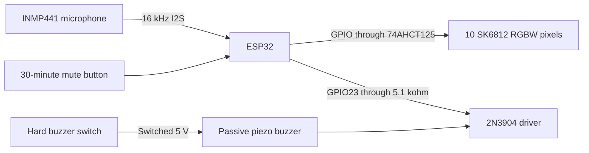
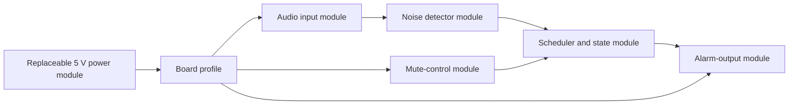
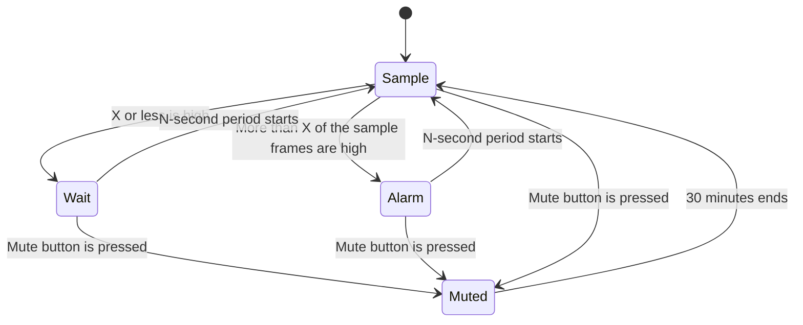

# System design

## Main signal path

The ESP32 reads audio samples but does not keep them. It calculates the sound
energy and discards each sample block.

## Module boundaries

The first power module is the ESP32 USB-C input and its 5 V header. A later
battery module can replace it. The audio and detector modules do not depend on
the power source.

## State flow

## Light result

The final high-frame ratio controls the alarm color. The sign stays off when
the ratio is X or less.

| High-frame ratio | Color |
| --- | --- |
| More than X, up to X + 15 percentage points | Yellow |
| More than X + 15, up to X + 30 percentage points | Orange |
| More than X + 30 percentage points | Red with a small warm-white value |

The brightness limit applies after the color is set. The default limit is 25%.

## Design choices

### INMP441 microphone

The INMP441 is suitable for the first build. Its digital output avoids ESP32
ADC noise. Its stable response helps with repeatable tests. It uses about
1.4 mA. A cheap sound switch module such as a KY-038 is not a good replacement.
Its set point can change with supply noise, temperature, and its adjustment
control.

For a lower-cost production version, test an analog MAX4466 microphone module.
It needs a new calibration and an ADC filter. Do not change the first
prototype until the INMP441 result is known.

### Light output

The LEDs do not draw letters. The printed front panel contains the word
`NOISE`. Ten pixels light a white diffuser behind the cut-out letters. Two
pixels behind each letter give an even light level. Ten pixels use about
167 mm of a 60-pixel/m strip.

### Future phone control

A later version can add a Bluetooth Low Energy service. Keep these settings as
separate values so the phone can change them:

- Sound set point
- Sample time K
- Sample period N
- High-frame ratio X
- Alarm colors and brightness
- Buzzer enable
- Mute time

Do not enable Bluetooth in the first version. It adds test work and power use.

## Source data

- [WEMOS D32 battery and charge data](https://www.wemos.cc/en/latest/d32/d32.html)
- [ESP32-DevKitC documentation](https://docs.espressif.com/projects/esp-dev-kits/en/latest/esp32/esp32-devkitc/user_guide.html)
- [ESP32 series data sheet](https://documentation.espressif.com/esp32_datasheet_en.html)
- [INMP441 data sheet](https://invensense.tdk.com/wp-content/uploads/2015/02/INMP441.pdf)
- [SK6812 RGBW data sheet](https://cdn-shop.adafruit.com/product-files/2757/p2757_SK6812RGBW_REV01.pdf)
- [SN74AHCT125 data sheet](https://www.ti.com/lit/gpn/SN74AHCT125)
