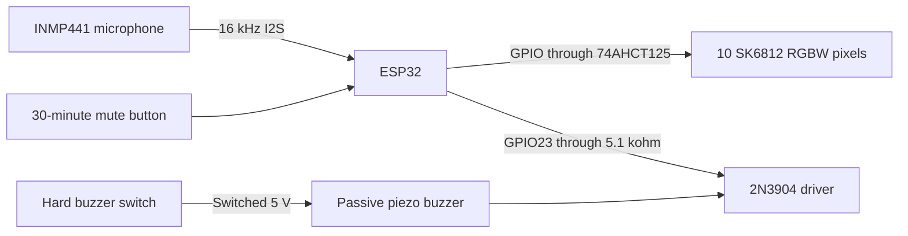
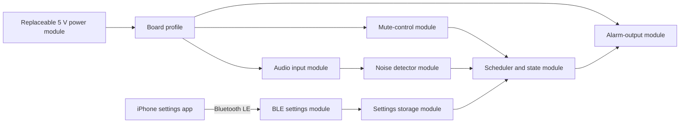

# System design

## Main signal path

The ESP32 reads audio samples but does not keep them. It calculates the sound
energy and discards each sample block.

## Module boundaries

The first power module is the ESP32 USB-C input and its 5 V header. A later
battery module can replace it. The audio and detector modules do not depend on
the power source.

## State flow

```mermaid
stateDiagram-v2
  [*] --> Observation
  Observation --> History: Save one-second maximum
  History --> AlarmOutput: More than X of the last six maxima cross a threshold
  History --> Wait: No threshold has more than X
  Wait --> Observation: N-second period starts
  AlarmOutput --> Recheck: 250 ms output ends
  Recheck --> AlarmOutput: Maximum reaches green, or fewer than two quiet checks
  Recheck --> Wait: Two consecutive quiet checks; reset history
  state Muted {
    [*] --> MutedObservation
    MutedObservation --> MutedWait: Save maximum and update history
    MutedWait --> MutedObservation: N-second period starts
  }
  Wait --> Muted: Mute button is pressed
  AlarmOutput --> Muted: Mute button is pressed
  Recheck --> Muted: Mute button is pressed
  Observation --> Muted: Mute button is pressed; observation continues
  Muted --> AlarmOutput: Mute ends and history crosses a threshold
  Muted --> Wait: Mute ends and history is below the thresholds
```

Mute gates the alarm outputs. It does not stop the microphone observation
schedule or clear the rolling history. A second button press within 750 ms
ends mute.

## Alarm result

Separate dBFS thresholds control the alarm level. At least four of the six
saved one-second maxima must cross a threshold to start its level. A sustained
alarm also becomes more urgent with time.

| Level | Default threshold | Light | Buzzer |
| --- | ---: | --- | --- |
| Green | -55 dBFS | Slow green blink | Silent |
| Orange | -48 dBFS | Medium orange blink | Two warning notes |
| Red | -42 dBFS | Fast red blink | Three warning notes |

After 15 seconds, the minimum alarm level is orange. After 30 seconds, it is
red. During an active alarm, each one-second maximum can update the level.
Two consecutive quiet checks clear the alarm within the configured
five-second limit.

The brightness limit applies after the color is set. The tested USB-powered
`esp32dev` profile uses 100%. The untested battery profile stays at 25%.

## Design choices

### INMP441 microphone

The INMP441 is suitable for the first build. Its digital output avoids ESP32
ADC noise. Its stable response helps with repeatable tests. It uses about
1.4 mA. A cheap sound switch module such as a KY-038 is not a good replacement.
Its set point can change with supply noise, temperature, and its adjustment
control.

For a lower-cost production version, test an analog MAX4466 microphone module.
It needs a new calibration and an ADC filter. Do not change the first
prototype until the INMP441 result is known.

### Light output

The LEDs do not draw letters. The printed front panel contains the word
`NOISE`. Ten pixels light a white diffuser behind the cut-out letters. Two
pixels behind each letter give an even light level. Ten pixels use about
167 mm of a 60-pixel/m strip.

### Phone control

The iPhone app uses Bluetooth Low Energy to manage the main settings. It keeps
one global profile and optional device overrides. The phone is the settings
source. Each ESP32 validates and saves one complete effective profile.

The app can change brightness, buzzer volume, three thresholds, mute duration,
K, N, decision-window time, and X. K, N, decision-window time, and X are global
only. See [iPhone app and Bluetooth settings](app-and-bluetooth.md).

Bluetooth stays on for device discovery and reconnect. Wi-Fi stays off. This
radio use can reduce battery time and needs a battery test.

## Source data

- [WEMOS D32 battery and charge data](https://www.wemos.cc/en/latest/d32/d32.html)
- [ESP32-DevKitC documentation](https://docs.espressif.com/projects/esp-dev-kits/en/latest/esp32/esp32-devkitc/user_guide.html)
- [ESP32 series data sheet](https://documentation.espressif.com/esp32_datasheet_en.html)
- [INMP441 data sheet](https://invensense.tdk.com/wp-content/uploads/2015/02/INMP441.pdf)
- [SK6812 RGBW data sheet](https://cdn-shop.adafruit.com/product-files/2757/p2757_SK6812RGBW_REV01.pdf)
- [SN74AHCT125 data sheet](https://www.ti.com/lit/gpn/SN74AHCT125)
