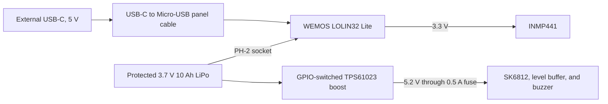

# Power and battery

## USB-powered option

Use the full-size USB-C ESP32 without a battery. A separate two-wire USB-C
connector supplies the common 5 V rail. The rail splits to the ESP32 `5V` or
`VIN` pin and to the peripheral rail through a 0.5 A resettable fuse.

Use a regulated 5 V supply that can give at least 2 A. A 5 V, 3 A supply gives
useful margin. Do not connect another power source to the ESP32 5 V or 3.3 V
pin.

Test the two-wire connector with a USB-C to USB-C cable before use. If it gives
5 V in both plug orientations, it already has a suitable sink circuit. If it
gives zero volts, use a USB-A to USB-C source or replace it with a two-wire
module that states that it has 5.1 kohm CC resistors.

The ESP32 chip and development board do not supply LED current. Both branches
receive 5 V directly from the two-wire power module. This star connection is
suitable for the first build with 10 pixels. A full-brightness test of the ten
pixels passed. It also makes a later power-module change easier.

The built-in ESP32 USB-C connector is used only for service. Disconnect the
two-wire power module before you connect the service port to a computer.

Use this conservative first-build budget:

| Load | Design allowance |
| --- | ---: |
| ESP32 board and microphone | 350 mA |
| Ten SK6812 RGBW pixels with the production colors at the 100% limit | 600 mA |
| Buzzer and level buffer | 50 mA |
| Total design allowance | 1,000 mA |

The 2 A supply rating gives margin for cable loss and startup current. Measure
the real value with a USB power meter.

## WEMOS battery option

The WEMOS stays inside the enclosure. Its built-in charger charges the
internal battery. The external USB-C panel connector is the only connector
necessary for power, charge, firmware upload, and the serial monitor.

The WEMOS charger current is approximately 500 mA. It is suitable for the
selected protected 1S battery, but it is slow. A 10,000 mAh battery has a
minimum ideal charge time of 20 hours. Allow 20 to 24 hours, and allow more
time if the device operates while it charges.

The charger is a simple linear charger. It is not a high-current USB power-bank
circuit. A continuous load can delay charge completion. Keep the alarm off
during the first full charge test. Confirm that the battery and charge circuit
do not become hot.

## Why the boost module is necessary

The WEMOS operates directly from the 3.0 V to 4.2 V battery range. The SK6812
strip needs a stable supply near 5 V. The WEMOS 3.3 V regulator cannot supply
the strip. Some LOLIN32 Lite versions do not expose a useful 5 V output when
they operate from the battery.

The TPS61023 module changes the battery voltage to approximately 5.2 V. GPIO13
enables it only during an alarm or an output test. The module has load
disconnect and a low shutdown current. Thus, the strip and buzzer do not drain
the battery between alarms.

Ten SK6812 RGBW pixels at the 25% firmware limit have a conservative maximum
estimate of approximately 200 mA at 5 V. The buzzer and level buffer add less
than 40 mA. This is below the selected boost module rating, but the value must
be confirmed with a current test.

## Battery pack

Use one factory-assembled 1S LiPo pack with these properties:

- Nominal voltage: 3.7 V
- Full voltage: 4.2 V
- Capacity: 10,000 mAh
- Size code: 1260110, approximately 12 mm by 60 mm by 110 mm
- Built-in PCM protection
- JST-PH 2.0 plug with confirmed polarity
- Charge-current rating of at least 0.5 A
- Discharge-current rating of at least 1 A

The pack stores approximately 37 Wh. Do not connect two packs in parallel.
Do not use a raw cell or loose cylindrical cells.

## Expected run time

The firmware stops the microphone clock and puts the ESP32 in light sleep
between sound samples. The WEMOS still powers its CH340 USB bridge, regulator,
and LEDs. These parts set the minimum current.

With the default `K = 1 second` and `N = 10 seconds`, use four to twelve days
only as a first estimate. A noisy room can reduce this time because the alarm
keeps the processor, boost module, and LEDs active. A measured low sleep
current can make a longer time possible.

| Change | Battery effect |
| --- | --- |
| Increase K | More active time and less battery time |
| Decrease N | More samples and less battery time |
| Increase N | Fewer samples and more battery time |
| Keep an alarm active | Much less battery time |
| Increase LED brightness | Much less battery time during an alarm |

Measure battery current at these points before you make a run-time claim:

1. Between samples with the boost off
2. During the one-second microphone observation
3. During a green alarm
4. During a red alarm with the buzzer switch on
5. During USB charge with the alarm off

## Enclosure rules

- Put the battery in a separate compartment.
- Use a removable cover with screws.
- Leave at least 2 mm of free space on each flat side of the pouch.
- Do not bend, clamp, glue, or puncture the pouch.
- Keep screw tips, sharp printed edges, and solder joints away from the pouch.
- Add ventilation slots near the WEMOS charge circuit.
- Keep the battery away from direct sun and other heat sources.
- Stop use if the battery becomes hot, changes shape, leaks, or smells.
- Do not charge the unit without supervision until charge tests are complete.

## Limits

The WEMOS built-in charger is useful and removes a separate charge board. Its
500 mA charge rate is the main compromise with a 10,000 mAh battery. The
development board also has more sleep current than a custom low-power board.
For reliable operation for several weeks, measure the prototype first. A later
custom board can remove the USB bridge and power LED.

## Sources

- [WEMOS D32 battery and charge data](https://www.wemos.cc/en/latest/d32/d32.html)
- [TPS61023 product data](https://www.ti.com/product/TPS61023)
- [SK6812 RGBW data sheet](https://cdn-shop.adafruit.com/product-files/2757/p2757_SK6812RGBW_REV01.pdf)
- [LiPo protection guidance](https://learn.adafruit.com/li-ion-and-lipoly-batteries/protection-circuitry)
- [CPSC high-energy battery standards](https://www.cpsc.gov/Regulations-Laws--Standards/Voluntary-Standards/Batteries-Fire-High-Energy-Density)
