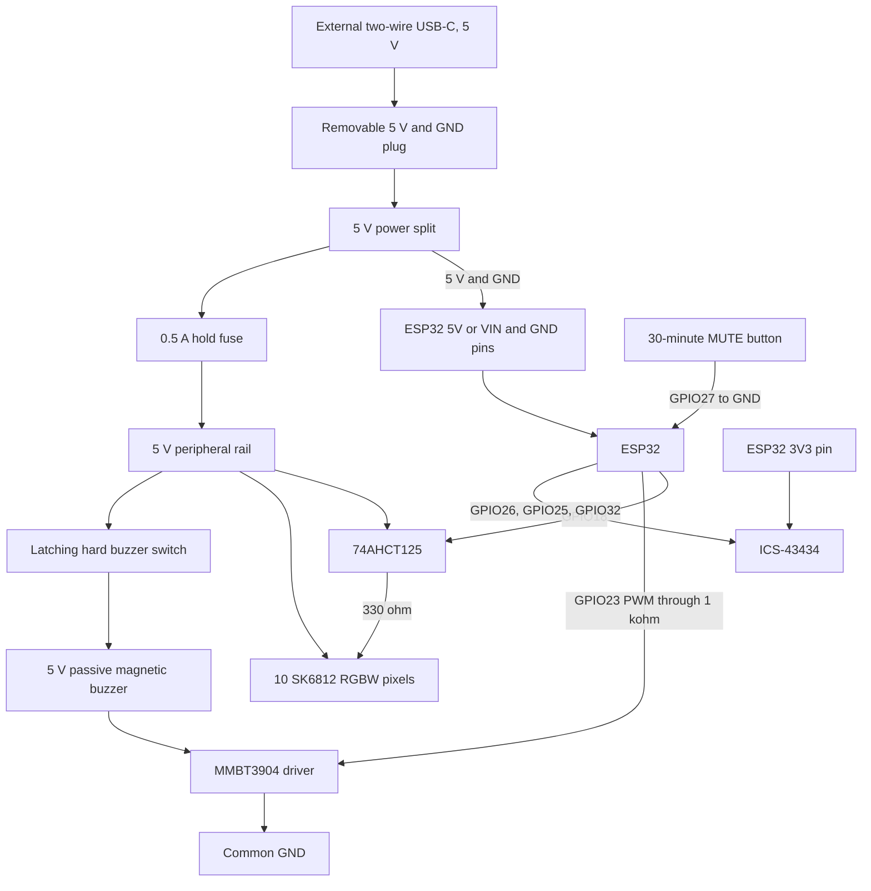
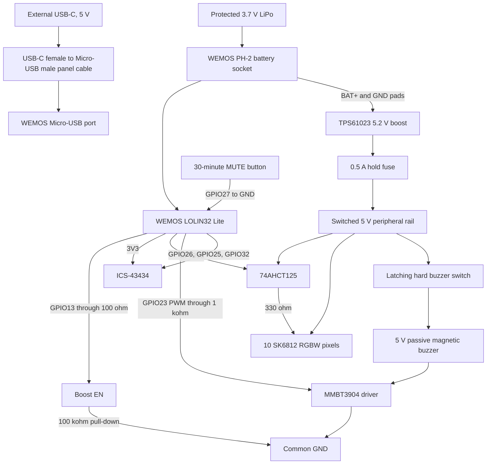

# Wiring

Both controller options use the same GPIO pins. The pin map avoids the flash
pins and the main startup-configuration pins.

## Pin map

| Function | Module pin | ESP32 pin | Power |
| --- | --- | --- | --- |
| Microphone clock | ICS-43434 SCK | GPIO26 | 3.3 V logic |
| Microphone word select | ICS-43434 WS | GPIO25 | 3.3 V logic |
| Microphone data | ICS-43434 SD | GPIO32 | 3.3 V logic |
| Microphone channel | ICS-43434 L/R | GND | Left channel |
| Sign data | 74AHCT125 input | GPIO18 | 3.3 V to 5 V level change |
| Buzzer control | MMBT3904 base through 1 kohm | GPIO23 | 3.3 V PWM |
| Peripheral power enable | TPS61023 EN | GPIO13 | Battery build only |
| 30-minute mute | Button to GND | GPIO27 | Internal pull-up |
| Buzzer enable | SPST switch in buzzer positive wire | No GPIO | Hard power cut |

## Carrier PCB

The production carrier PCB is in `hardware/pcb`. It keeps the ESP32 removable
and presents controller signals on the 10-pin J2 connector. J1, J2, and J3
are on the lower PCB face, and their cables point down. The microphone and
buzzer are on the PCB.

For the full-size ESP32, connect J2 as follows:

| J2 pin | Signal | ESP32 connection |
| ---: | --- | --- |
| 1 | 5 V input | `5V` or `VIN` |
| 2 | GND | GND |
| 3 | 3.3 V | `3V3` |
| 4 | Microphone clock | GPIO26 |
| 5 | Microphone word select | GPIO25 |
| 6 | Microphone data | GPIO32 |
| 7 | LED data | GPIO18 |
| 8 | Buzzer PWM | GPIO23 |
| 9 | Mute input | GPIO27 |
| 10 | GND | GND |

The carrier is also electrically usable with an ESP32-C3 adapter cable, but
the current firmware does not have an ESP32-C3 build. See
`hardware/pcb/controller-adapters.md` before you make that cable.

The home-milled Rev C board keeps GPIO26, GPIO25, GPIO32, GPIO18, GPIO23, and
GPIO27. It uses individual solder-wire pads. It does not use a JST housing.
Its round MH-ET LIVE INMP441 module has a two-row by three-pin footprint. See
`hardware/pcb/cnc/pinout.md` for every pad and its marked-face orientation.

## USB-powered build

Use this production circuit with the full-size USB-C ESP32. Do not install a
battery. The external USB-C connector carries power only.



Leave GPIO13 disconnected in this build. The firmware can operate the pin,
but the `esp32dev` build does not configure it as a power-control output.

The power input splits before the ESP32. Thus, LED current does not pass
through the ESP32 board. Do not use `3V3` or a GPIO pin for strip power.

The ESP32 built-in USB-C port is a service port. Before you connect it to a
computer, disconnect the removable external-power plug. Do not supply the
ESP32 `5V` or `VIN` pin and its USB port at the same time.

Before you connect the strip, use a multimeter to confirm that the selected
header pin has 4.75 V to 5.25 V relative to GND. Start with one pixel. Then add
the complete 10-pixel section.

Test the external power connector in both cable orientations. Test firmware
upload separately through the ESP32 built-in USB-C port.

## WEMOS battery build

The WEMOS charger supplies the ESP32 from USB or the battery. The switched
boost module supplies the 5 V LEDs, level buffer, and buzzer.



With the battery disconnected, solder the boost `VIN+` and `GND` wires to the
same WEMOS solder pads as the battery socket. Do not solder wires to the
battery pack. Use 22 AWG wire for these two connections. Confirm the pad
polarity with a multimeter before you solder.

Connect the boost enable circuit as follows:

```text
WEMOS GPIO13 -> 100 ohm -> TPS61023 EN
TPS61023 EN  -> 100 kohm -> GND
```

The pull-down keeps the boost off while the ESP32 starts or resets. Do not use
the WEMOS 3.3 V output or an uncertain 5 V pin to supply the LED strip.

## Digital microphone

The production carrier has an ICS-43434 microphone. Its signals are:

```text
ICS-43434 VDD  -> ESP32 3V3
ICS-43434 GND  -> ESP32 GND
ICS-43434 SCK  -> ESP32 GPIO26
ICS-43434 WS   -> ESP32 GPIO25
ICS-43434 SD   -> ESP32 GPIO32
ICS-43434 L/R  -> GND
```

The microphone is on the lower PCB face. Its acoustic port points through a
0.5 mm PCB hole to the case top. Align the case microphone hole with this PCB
hole. Do not cover it with glue, foam, or a label.

An INMP441 module remains suitable for a hand-wired prototype. It uses the
same SCK, WS, SD, 3.3 V, GND, and L/R signal functions.

The firmware reads both I2S channel slots and uses the slot with the higher
signal. Keep `L/R` connected to GND for a defined channel and stable operation.

## SK6812 level circuit

The SK6812 has a 5 V data input. The production carrier uses an
SN74AHCT125PWR. Do not use a BSS138 I2C level shifter. The AHCT input accepts
the 3.3 V ESP32 signal when the part has a 5 V supply.

```text
SN74AHCT125 pin 14 VCC -> 5 V peripheral rail
SN74AHCT125 pin 7  GND -> GND
SN74AHCT125 pin 1  /OE -> GND
SN74AHCT125 pin 2  1A  -> ESP32 GPIO18
SN74AHCT125 pin 3  1Y  -> 330 ohm -> first SK6812 DIN
100 nF capacitor       -> between pin 14 and pin 7

5 V peripheral rail -> strip +5V at both ends
Common GND           -> strip GND at both ends
First pixel DOUT     -> next pixel DIN
```

Tie unused AHCT inputs to GND. Disable unused outputs with their `/OE` pins at
5 V. Put a 1,000 uF, 10 V capacitor between 5 V and GND near the strip. Check
the capacitor polarity before you apply power.

Most SK6812 RGBW strips use the `GRBW` data order. The firmware uses this order.
If a one-pixel test gives wrong colors, do not change the wiring. Change the
pixel order in `firmware/src/main.cpp` to match the strip data sheet.

## Buzzer circuit

The production carrier uses a 5 V passive electromagnetic buzzer. Use this
circuit:

```text
5 V peripheral rail -> latching hard switch -> buzzer +
Buzzer other pin -> MMBT3904 collector
MMBT3904 emitter -> GND
ESP32 GPIO23 -> 1 kohm -> MMBT3904 base
Flyback diode anode -> MMBT3904 collector
Flyback diode cathode -> switched 5 V
```

GPIO23 sends a 2.4 kHz PWM signal. The 1 kohm resistor limits the transistor
base current. The switch opens the 5 V buzzer supply, so software cannot
override it. D1 absorbs the inductive turn-off pulse from the buzzer coil.
Measure the buzzer current during the first power test.

## Controls

Use one normally-open momentary button. Connect one side to GND and the other
side to GPIO27. One press turns off the alarm outputs for the configured mute
time. Sound observations and Bluetooth history continue at the configured
sample interval. Press the button a second time within 750 ms to end mute. A
single press after this time restarts the complete mute period.

Use the maintained switch as a hard switch for the buzzer. The carrier uses
one pole of a DPDT push-push switch between the 5 V peripheral rail and the
buzzer positive pin. Its extended state connects power and enables the buzzer.
The switch does not use a separate ESP32 input.

## Test order

1. Build and test the ESP32 and microphone.
2. Measure the boost output. It must be from 4.8 V to 5.3 V.
3. Test one SK6812 pixel at the 25% brightness limit.
4. Connect all 10 pixels.
5. Test the magnetic buzzer, MMBT3904, flyback diode, and switch last.
6. Measure current in quiet, sample, and alarm states.

Use one common ground for all parts. Test for a short circuit before you
connect the battery or USB supply.
