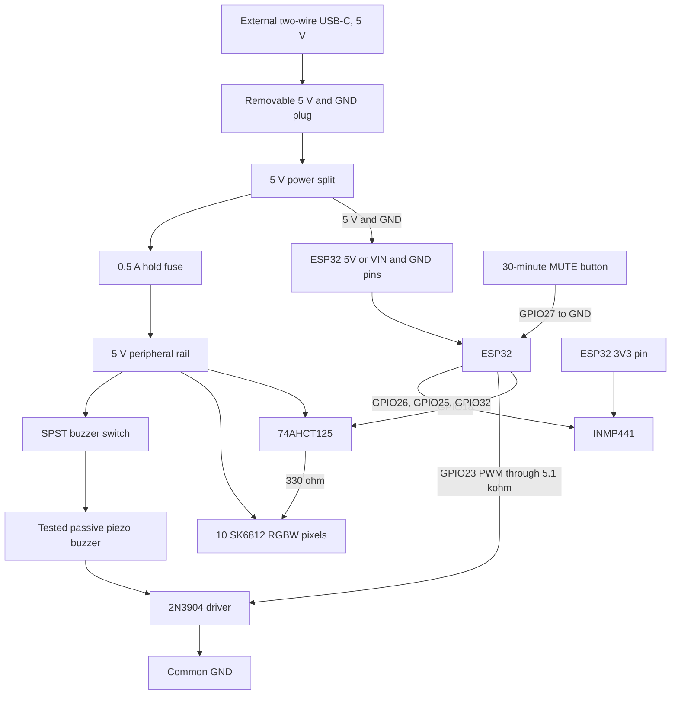
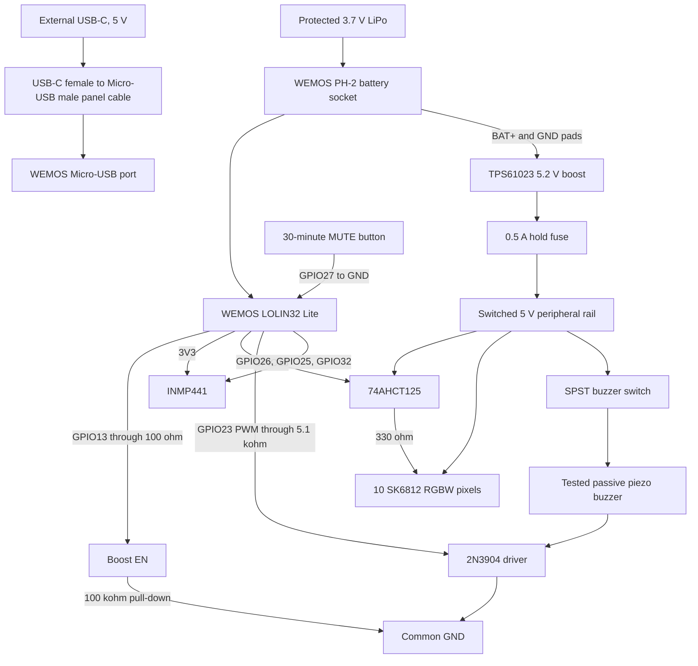

# Wiring

Both controller options use the same GPIO pins. The pin map avoids the flash
pins and the main startup-configuration pins.

## Pin map

| Function | Module pin | ESP32 pin | Power |
| --- | --- | --- | --- |
| Microphone clock | INMP441 SCK | GPIO26 | 3.3 V logic |
| Microphone word select | INMP441 WS | GPIO25 | 3.3 V logic |
| Microphone data | INMP441 SD | GPIO32 | 3.3 V logic |
| Microphone channel | INMP441 L/R | GND | Left channel |
| Sign data | 74AHCT125 input | GPIO18 | 3.3 V to 5 V level change |
| Buzzer control | 2N3904 base through 5.1 kohm | GPIO23 | 3.3 V PWM |
| Peripheral power enable | TPS61023 EN | GPIO13 | Battery build only |
| 30-minute mute | Button to GND | GPIO27 | Internal pull-up |
| Buzzer enable | SPST switch in buzzer positive wire | No GPIO | Hard power cut |

## USB-powered build

Use this production circuit with the full-size USB-C ESP32. Do not install a
battery. The external USB-C connector carries power only.



Leave GPIO13 disconnected in this build. The firmware can operate the pin,
but the `esp32dev` build does not configure it as a power-control output.

The power input splits before the ESP32. Thus, LED current does not pass
through the ESP32 board. Do not use `3V3` or a GPIO pin for strip power.

The ESP32 built-in USB-C port is a service port. Before you connect it to a
computer, disconnect the removable external-power plug. Do not supply the
ESP32 `5V` or `VIN` pin and its USB port at the same time.

Before you connect the strip, use a multimeter to confirm that the selected
header pin has 4.75 V to 5.25 V relative to GND. Start with one pixel. Then add
the complete 10-pixel section.

Test the external power connector in both cable orientations. Test firmware
upload separately through the ESP32 built-in USB-C port.

## WEMOS battery build

The WEMOS charger supplies the ESP32 from USB or the battery. The switched
boost module supplies the 5 V LEDs, level buffer, and buzzer.



With the battery disconnected, solder the boost `VIN+` and `GND` wires to the
same WEMOS solder pads as the battery socket. Do not solder wires to the
battery pack. Use 22 AWG wire for these two connections. Confirm the pad
polarity with a multimeter before you solder.

Connect the boost enable circuit as follows:

```text
WEMOS GPIO13 -> 100 ohm -> TPS61023 EN
TPS61023 EN  -> 100 kohm -> GND
```

The pull-down keeps the boost off while the ESP32 starts or resets. Do not use
the WEMOS 3.3 V output or an uncertain 5 V pin to supply the LED strip.

## INMP441

Connect the module as follows:

```text
INMP441 VDD  -> ESP32 3V3
INMP441 GND  -> ESP32 GND
INMP441 SCK  -> ESP32 GPIO26
INMP441 WS   -> ESP32 GPIO25
INMP441 SD   -> ESP32 GPIO32
INMP441 L/R  -> GND
```

Keep these wires below 100 mm. Put the microphone away from the buzzer and the
power circuit. Point the acoustic hole at the case microphone hole. Do not
cover it with glue.

The firmware reads both I2S channel slots and uses the slot with the higher
signal. Keep `L/R` connected to GND for a defined channel and stable operation.

## SK6812 level circuit

The SK6812 has a 5 V data input. Use an SN74AHCT125N. Do not use a BSS138 I2C
level shifter. The AHCT input accepts the 3.3 V ESP32 signal when the part has
a 5 V supply.

```text
SN74AHCT125 pin 14 VCC -> 5 V peripheral rail
SN74AHCT125 pin 7  GND -> GND
SN74AHCT125 pin 1  /OE -> GND
SN74AHCT125 pin 2  1A  -> ESP32 GPIO18
SN74AHCT125 pin 3  1Y  -> 330 ohm -> first SK6812 DIN
100 nF capacitor       -> between pin 14 and pin 7

5 V peripheral rail -> strip +5V at both ends
Common GND           -> strip GND at both ends
First pixel DOUT     -> next pixel DIN
```

Tie unused AHCT inputs to GND. Disable unused outputs with their `/OE` pins at
5 V. Put a 1,000 uF, 10 V capacitor between 5 V and GND near the strip. Check
the capacitor polarity before you apply power.

Most SK6812 RGBW strips use the `GRBW` data order. The firmware uses this order.
If a one-pixel test gives wrong colors, do not change the wiring. Change the
pixel order in `firmware/src/main.cpp` to match the strip data sheet.

## Buzzer circuit

The passive buzzer gave a clear tone from 3.3 V. The tested 5 V circuit is
much louder. Use this circuit:

```text
5 V peripheral rail -> SPST buzzer switch -> buzzer +
Buzzer other pin -> 2N3904 collector
2N3904 emitter -> GND
ESP32 GPIO23 -> 5.1 kohm -> 2N3904 base
```

GPIO23 sends a 2.4 kHz PWM signal. The 5.1 kohm resistor limits the transistor
base current. The switch opens the 5 V buzzer supply, so software cannot
override it. A flyback diode is not necessary for the tested piezo buzzer.

For a TO-92 2N3904 with its flat face towards you and its legs down, the pins
are emitter, base, and collector from left to right. Confirm the pin order for
the part before you solder it. Measure the buzzer current before final
assembly.

This result applies only to the tested buzzer and 2N3904 circuit.

## Controls

Use one normally-open momentary button. Connect one side to GND and the other
side to GPIO27. One press stops the current sample, turns off the alarm, and
prevents new samples for 30 minutes. A second press starts a new 30-minute
period.

Use a maintained SPST switch for the buzzer. Put it between the 5 V peripheral
rail and the buzzer positive pin. This switch does not use a separate ESP32
input.

## Test order

1. Build and test the ESP32 and microphone.
2. Measure the boost output. It must be from 4.8 V to 5.3 V.
3. Test one SK6812 pixel at the 25% brightness limit.
4. Connect all 10 pixels.
5. Add the tested passive piezo buzzer, 2N3904, and switch last.
6. Measure current in quiet, sample, and alarm states.

Use one common ground for all parts. Test for a short circuit before you
connect the battery or USB supply.
