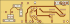

# ESPNoise Rev C CNC board

This directory contains a two-copper-face board for a 70 mm by 50 mm FR-4
blank. It is a prototype. Mill the coupon before you mill the complete board.

The user face has these parts:

- SW1, mute button
- SW2, hard buzzer switch
- MIC1, INMP441 module
- BZ1, passive buzzer

The internal face has all other component bodies and all cable connectors.
The solder joints and copper tracks can be visible on the opposite face.




The electrical schematic is in `espnoise-cnc-schematic.svg`. The exact pin
connections are in `espnoise-cnc-netlist.csv`. The editable PCB is
`espnoise-cnc.kicad_pcb`. The generator is the controlled layout source.

## Important design limits

- Board size: 70 mm by 50 mm
- Copper faces: two
- Minimum track width: 0.50 mm
- Minimum checked copper clearance: 0.40 mm
- Power track width: 0.60 mm
- Registration holes: two 2.0 mm holes on the X = 35 mm flip axis
- Wire vias: 0.8 mm holes with 1.8 mm copper pads
- No plated holes and no solder mask
- No board outline cut; the board uses the complete 70 mm by 50 mm blank

The CNC board uses 2.50 mm JST-XH headers. The factory board uses 2.00 mm
JST-PH headers. Do not use a factory-board cable housing on this board.

MIC1 is a six-pin INMP441 module. The PCB pin order is `SCK`, `WS`, `L/R`,
`SD`, `VDD`, `GND`. Some seller modules use a different pin order. Confirm
the printed module labels before you solder it. Orient its acoustic opening
towards the user. Measure the real module before you change the case.

## Generate the files

Install `pcb2gcode`. On macOS, use this command:

```sh
brew install pcb2gcode
```

Then run this command from the repository root:

```sh
./hardware/pcb/cnc/build-machine-files.sh
```

The script does these tasks:

1. It generates the KiCad board, Gerber files, drill tables, views, and BOM.
2. It checks board limits and copper clearance.
3. It makes the two mirrored isolation jobs with `pcb2gcode`.
4. It makes one G-code file for each drill size.
5. It removes interactive tool-change commands from single-tool jobs.
6. It checks all X, Y, and Z limits and writes SHA-256 checksums.

The ready files are in `machine`. Do not run them until the coupon and the
preflight checks in `cubiko-guide.md` pass.

## Source files

| File | Purpose |
| --- | --- |
| `generate_cnc_board.py` | Board source, router, checks, and Gerber generator |
| `espnoise-cnc.kicad_pcb` | Editable and reviewable KiCad board |
| `espnoise-cnc-schematic.svg` | Electrical schematic |
| `espnoise-cnc-netlist.csv` | Exact pin-to-net table |
| `espnoise-cnc-bom.csv` | CNC-board parts and face assignment |
| `millproject` | Full-board Cubiko CAM values |
| `millproject-coupon` | Coupon CAM values |
| `generate_drill_gcode.py` | One-job-per-drill-size generator |
| `clean_and_check_gcode.py` | GRBL cleanup, bounds check, and checksums |
