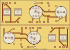
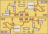

# ESPNoise Rev C CNC panel

This directory contains a two-copper-face PCB for the Genmitsu Cubiko. One
70 mm by 50 mm FR-4 blank makes two 70 mm by 24.5 mm PCB units. A 1.0 mm
center cut separates the units after all other jobs finish.

Unit A is in the lower 24.5 mm of the source coordinates. Unit B has a
180-degree rotation. Thus, the center cut makes the same local edge on both
units. This center edge is the cut edge that can have the least good finish.

The mute button, hard buzzer switch, microphone acoustic center, and buzzer
center are on one line at local Y = 12.25 mm. Their local X positions are
7 mm, 18 mm, 36 mm, and 61 mm. All other component bodies and all wire
terminals are on the internal face.





The electrical schematic is in `espnoise-cnc-schematic.svg`. The exact pin
connections are in `espnoise-cnc-netlist.csv`. The editable unit PCB is
`espnoise-cnc.kicad_pcb`. The generator is the controlled layout source.

## Important design limits

- Raw panel: 70 mm by 50 mm
- Finished unit: 70 mm by 24.5 mm
- Center tool path: Y = 25 mm
- Copper faces: two
- Minimum track width: 0.50 mm
- Minimum checked copper clearance: 0.40 mm
- Power track width: 0.60 mm
- Registration holes: two 2.0 mm panel holes on X = 35 mm
- Wire vias: 0.8 mm holes with 1.7 mm copper pads
- No plated holes and no solder mask
- 1.2 mm holes for the individual wire terminals
- No insulated link wires
- No LED logic-level IC

The board uses direct insulated wires instead of cable headers. `P1` is the
external 5 V power input. `W1` through `W9` go to the ESP32. `W10` through
`W12` go to the LED strip. The exact signal for each terminal is in the BOM,
netlist, schematic, and internal-face SVG.

| Terminal | Connection |
| --- | --- |
| P1-1 / P1-2 | External +5 V / GND |
| W1 / W2 | ESP32 5 V / GND |
| W3 | ESP32 mute GPIO |
| W4 / W5 / W6 | ESP32 microphone SCK / WS / SD |
| W7 | ESP32 3.3 V for the microphone |
| W8 | ESP32 LED data GPIO |
| W9 | ESP32 buzzer GPIO |
| W10 / W11 / W12 | LED +5 V / data / GND |

The LED data path is the ESP32 3.3 V signal through R1, a 330 ohm series
resistor. This matches the tested prototype and the short wire path for 10 to
12 pixels. If the installed strip is not reliable, add an external 5 V logic
buffer near the strip. Do not add a long unbuffered data wire.

The buzzer driver parts stay on the board. The specified magnetic 5 V buzzer
must not connect directly to an ESP32 GPIO. SW2 stays as a hard switch in the
buzzer power wire and can remove all buzzer power.

MIC1 is a six-pin INMP441 module. The PCB pin order from low X to high X is
`SCK`, `WS`, `L/R`, `SD`, `VDD`, `GND`. Some seller modules use a different
pin order or a different board size. Confirm the printed labels. Measure the
real module and its acoustic port before you make the case holes.

## Generate the files

Install `pcb2gcode`. On macOS, use this command:

```sh
brew install pcb2gcode
```

Then run this command from the repository root:

```sh
uv run --locked opendle-cnc build --config opendle-tools.toml
```

The script does these tasks:

1. It generates the unit PCB and the two-unit panel files.
2. It checks the board limits, body overlap, copper width, and clearance.
3. It makes the two mirrored panel isolation jobs with `pcb2gcode`.
4. It makes one panel G-code file for each drill size.
5. It makes the last center-cut job for a 1.0 mm PCB router bit.
6. It checks all X, Y, and Z limits and writes SHA-256 checksums.

The ready files are in `machine`. Do not run them until the coupon and the
preflight checks in `cubiko-guide.md` pass.

## Source files

| File | Purpose |
| --- | --- |
| `generate_cnc_board.py` | Unit source, panel source, router, and checks |
| `espnoise-cnc.kicad_pcb` | Editable and reviewable 70 mm by 24.5 mm unit |
| `espnoise-panel-user.svg` | Two-unit user-face check view |
| `espnoise-panel-internal.svg` | Two-unit internal-face check view |
| `espnoise-cnc-schematic.svg` | Electrical schematic |
| `espnoise-cnc-netlist.csv` | Exact pin-to-net table |
| `espnoise-cnc-bom.csv` | Parts and face assignment for one unit |
| `millproject` | Two-unit panel isolation values |
| `millproject-coupon` | Coupon isolation values |
| `opendle-tools.toml` | Project paths, process values, and machine limits |
| `opendle-electronics` | Pinned shared CAM, G-code checks, and manifests |
